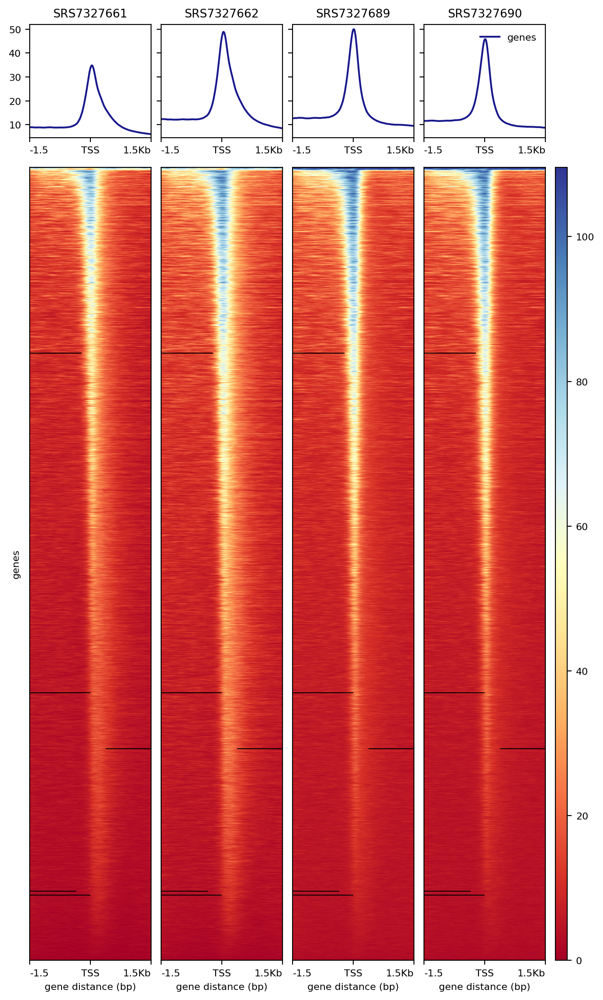
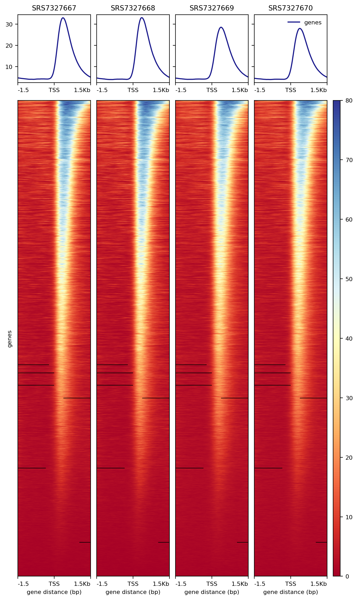

# Data preprocessing documentataion
This documentation is about preprocessing ATAC- and ChIP-seq data. The pipeline
is used to create bam files from public new generation sequencing (NGS) data
(fastq files) downloaded from NCBI's (National Center for Biotechnology Information)
SRA (Sequence Read Archive).   
     
## 1. Required tools
The tool version numbers are the ones used during this project.   
      
- SRA-Toolkit 3.0.0 (SRA Toolkit - GitHub)
- Java 1.8.0 (Arnold et al., 2005)
- Trimmomatic 0.36 (Bolger et al., 2014)
- FastQC 0.11.9 (Babraham Bioinformatics - FastQC A Quality Control Tool
for High Throughput Sequence Data)
- MultiQC 1.14 (Ewels et al., 2016)
- BWA 2.1 (Md et al., 2019)
- SamTools 1.6 (Danecek et al., 2021)
- Picard (Picard Tools - By Broad Institute, n.d.)
- deepTools 3.5.1 (Ramírez et al., 2016)
- Helixer 0.3.1 (Stiehler et al., 2021; Weberlab: Institute of Plant Biochemistry,
HHU: GitHub, n.d.)
- Helixer Post (https://github.com/TonyBolger/HelixerPost)
- gffread (Pertea & Pertea, 2020)
- GeenuFF 0.3.0 (Weberlab: Institute of Plant Biochemistry, HHU: GitHub, n.d.)
     
## 2. Pipeline
| Category | Download data |      Trimming       | Quality control |     Mapping     | Quality control | Deduplication/Data cleaning |         Quality control         |
|:--------:|:-------------:|:-------------------:|:---------------:|:---------------:|:---------------:|:---------------------------:|:-------------------------------:|
|  Tools   |  SRA Toolkit  | Trimmomatic<br>Java |     FastQC      | BWA<br>SamTools |    SamTools     | Picard<br>Java<br>SamTools  | deepTools<br>Helixer<br>gffread |
    

### 2.1. Download data
**Tools:** SRA toolkit    
**Setup:** The path to the toolkit 
``export PATH=$PATH:<path_to>/sratoolkit.3.0.0-ubuntu64/bin`` needs to be in
your ``.bashrc``. When first configuring the SRA toolkit, be sure to set the local
file caching to a folder of sufficient size, so **not** your home directory
(see https://github.com/ncbi/sra-tools/wiki/05.-Toolkit-Configuration).    
     
There are two options for downloading the runs from SRA: fastq-dump and
fasterq-dump. The program calls are similar, with fastq-dump downloading the
files in qzip format while fasterq-dump downloads faster, but doesn't zip the
fastq files.   

#### 2.1.1. Fastq-dump
```bash
fastq-dump <SRR_accsession> --gzip --split-3

```
#### 2.1.2. Fasterq-dump
```bash
fasterq-dump <SRR_accsession> --split-3

gzip <SRR_accsession>_1.fastq <SRR_accsession>_2.fastq  # for paired end data

```

#### 2.1.3. Special case: single cell data
```bash
prefetch <SRR_accsession>
fasterq-dump <SRR_accsession> -S --include-technical

gzip <SRR_accsession>_3.fastq <SRR_accsession>_4.fastq 
```
Unzipped fastq files also work, as trimmomatic accepts them as well.
It is however necessary to rename the forward read from <SRR_accsession>_3.fastq to
<SRR_accsession>_1.fastq and the reverse reads from <SRR_accsession>_4.fastq to
<SRR_accsession>_2.fastq.
     
### 2.2. Trimming
**Tools:** Java 1.8.0, Trimmomatic 0.36    
**Hint:** ATAC-seq data usually uses Nextera adapters, so use NexteraPE-PE.fa for
paired ATAC-seq and TruSeq3-PE-2.fa for paired ChIP-seq data.
    
```bash
# paired end data
java -jar -Xmx2048m <path_to_trimmomatic>/trimmomatic-0.36.jar PE -threads 2 \
-basein <sample_ID>_1.fastq.gz -baseout <out_path>/<sample_ID>.fastq.gz \
ILLUMINACLIP:<path_to_trimmomatic>/adapters/TruSeq3-PE-2.fa:3:30:10:1:true \
MAXINFO:36:0.7

# single end data
java -jar -Xmx2048m <path_to_trimmomatic>/trimmomatic-0.36.jar SE -threads 2 \
<sample_ID>.fastq.gz <out_path>/<sample_ID>.fastq.gz \
ILLUMINACLIP:<path_to_trimmomatic>/adapters/TruSeq3-SE.fa:2:30:10 MAXINFO:36:0.7
```
    
### 2.3. Quality control
**Tools:** FastQC
```bash
# paired end data
fastqc <sample_ID>_1P.fastq.gz
fastqc <sample_ID>_2P.fastq.gz

# single end data
fastqc <sample_ID>.fastq.gz
```
**Hint:** [MultiQC](https://multiqc.info) was used to generate summary html reports.
     
### 2.4. Mapping
**Tools:** BWA, SamTools
     
#### 2.4.1. Genome indexing
```bash
bwa-mem2 index -p <path_to_genome>/<species> <path_to_genome>/<species>.fa
```
     
#### 2.4.2. Mapping
```bash
# paired end data
bwa-mem2 mem <path_to_genome>/<species> <(zcat <sample_ID>_1P.fastq.gz) \
<(zcat <sample_ID>_2P.fastq.gz) > <sample_ID>.sam

# single end data
bwa-mem2 mem <path_to_genome>/<species> <(zcat <sample_ID>.fastq.gz) > \
<sample_ID>.sam

# sort and index
samtools view <sample_ID>.sam -b |samtools sort -T tmp<sample_ID> -@1 \
-o <sample_ID>.bam
samtools index <sample_ID>.bam
```
     
### 2.5. Quality control
**Tools:** SamTools    
     
Check for percentage of reads mapped, mates paired, etc.    
     
```bash
samtools flagstat <sample_ID>.bam > <sample_ID>.txt
```
    
### 2.6. Deduplication/Data cleaning
**Tools:** Picard, Java, SamTools    
    
Common errors are:
- the picard output just ends without signaling that picard finished and
there is no output bam file
- java.lang.OutOfMemoryError: Java heap space
- java.lang.OutOfMemoryError: GC overhead limit exceeded
    
The **solution** is extending the java heap space, so replacing
-Xmx1G with -Xmx2G or even -Xmx3G.    
    
```bash
# picard
java -Xmx1G -jar <path_to_picard>/picard.jar MarkDuplicates I=<sample_ID>.bam \
O=<sample_ID>_marked.bam M=<sample_ID>.stats

# filter with samtools
samtools view -F 1796 <sample_ID>_marked.bam -b > <sample_ID>.bam
# -F 1796 filters out duplicates, unmapped reads, non-primary alignments 
# and reads not passing platform quality checks
samtools index <sample_ID>.bam
```
     
### 2.7. Quality control
**Tools:** deepTools, Helixer, gffread   
    
Only the predictions/annotation from Helixer were used for consistency, but if the
genome already has an annotation you can also use that and skip the fourth step.
You can also blacklist regions (bed file) in the fifth step, if the previous plot
was too noisy. An easy way is to blacklist the chloroplast, mitochondrion and unplaced
scaffolds, as they have been observed to frequently cause noise in ATAC-seq data.
    
#### 2.7.1. Plot coverage
```bash
files=`ls <folder_of_deduplicated_files>/*.bam`
<path_to_deeptools>/deepTools/bin/plotCoverage -b $files \
--plotFile <species>Coverage.png --smartLabels --outRawCounts deduplicated/raw.txt
```
#### 2.7.2. Plot fingerprint
```bash
files=`ls <folder_of_deduplicated_files>/*.bam`
<path_to_deeptools>/deepTools/bin/plotFingerprint -b $files \
--plotFile <species>Fingerprint.png --smartLabels --binSize 500 \
--numberOfSamples 500_000
# if the genome is equal or smaller than 250 Mbp, please adjust the defaults of 
# binsize (500) and numberOfSamples (500_000) oof plotFingerprint, so that
# binsize x numberOfSamples < genome size
```
#### 2.7.3. Bam to bigwig
```bash
files=`ls deduplicated/*2.bam`

for file in $files; do
    <path_to_deeptools>/deepTools/bin/bamCoverage -b $file -o $(basename $file .bam).bw -of bigwig
done
```
#### 2.7.4. Helixer annotation
```bash
<path_to_helixer>/Helixer/Helixer.py --lineage land_plant --fasta-path <species>.fa \
--species <full_species_name> --gff-output-path <species>_land_plant_v0.3_a_0080_helixer.gff3 \
--model-filepath <path_to_best_model>/land_plant_v0.3_a_0080.h5 --batch-size 150 \
--subsequence-length 21384 --temporary-dir <temp_dir>
# change batch size/subsequence length as your GPU can handle/as you need
# full species name example: Arabidopsis_thaliana
```
>**Warning:** To create the annotation, you will need an Nvidia GPU, their CUDA
> toolkit and cuDNN. (see https://github.com/weberlab-hhu/Helixer)
     
#### 2.7.5. Compute matrix
```bash
# convert predictions or reference annotation to bed
gffread helixer_pred/<species>_land_plant_v0.3_a_0080_helixer.gff3 \
--bed -o <species>_helixer.bed

# compute matrix
files=`ls <path_to_bigwig_files>*.bw`
<path_to_deeptools>/deepTools/bin/computeMatrix reference-point \
-S $files -R <species>_helixer.bed --smartLabels \
-o <species>_matrix.mat.gz --upstream 1500 --downstream 1500
```
     
#### 2.7.6. Plot heatmap
```bash
<path_to_deeptools>/deepTools/bin/plotHeatmap -m deepqc/<species>_matrix.mat.gz \
-o <species>_tss_heatmap.png
```
    
The heatmap should show a peak in front of/around the transcription start site (TSS)
for ATAC-seq and behind the TSS for H3K4me3 ChIP-seq.   
     
**ATAC-seq example of _Brachypodium distachyon_:**

     
**ChIP-seq example of _Brachypodium distachyon_:**

     
### References
- Arnold, K., Gosling, J., & Holmes, D. (2005). The Java programming language.
Addison Wesley Professional.
- Babraham Bioinformatics - FastQC A Quality Control tool for High Throughput
Sequence Data. (n.d.). Retrieved May 23, 2022, from
https://www.bioinformatics.babraham.ac.uk/projects/fastqc/
- Bolger, A. M., Lohse, M., & Usadel, B. (2014). Trimmomatic: a flexible trimmer
for Illumina sequence data. Bioinformatics, 30(15), 2114.
https://doi.org/10.1093/BIOINFORMATICS/BTU170
- Danecek, P., Bonfield, J. K., Liddle, J., Marshall, J., Ohan, V., Pollard, M. O.,
Whitwham, A., Keane, T., McCarthy, S. A., Davies, R. M., & Li, H. (2021). Twelve
years of SAMtools and BCFtools. GigaScience, 10(2).
https://doi.org/10.1093/GIGASCIENCE/GIAB008
- Ewels, P., Magnusson, M., Lundin, S., & Käller, M. (2016). MultiQC: summarize
analysis results for multiple tools and samples in a single report. Bioinformatics,
32(19), 3047–3048. https://doi.org/10.1093/BIOINFORMATICS/BTW354
- Md, V., Misra, S., Li, H., & Aluru, S. (2019). Efficient architecture-aware
acceleration of BWA-MEM for multicore systems. Proceedings - 2019 IEEE 33rd
International Parallel and Distributed Processing Symposium, IPDPS 2019, 314–324.
https://doi.org/10.1109/IPDPS.2019.00041
- Pertea, G., & Pertea, M. (2020). GFF Utilities: GffRead and GffCompare.
F1000Research, 9, 304. https://doi.org/10.12688/F1000RESEARCH.23297.2
- Picard Tools - By Broad Institute. (n.d.). Retrieved May 23, 2022,
from https://broadinstitute.github.io/picard/
- Ramírez, F., Ryan, D. P., Grüning, B., Bhardwaj, V., Kilpert, F., Richter,
A. S., Heyne, S., Dündar, F., & Manke, T. (2016). deepTools2: a next generation
web server for deep-sequencing data analysis. Nucleic Acids Research, 44(W1),
W160–W165. https://doi.org/10.1093/NAR/GKW257
- Stiehler, F., Steinborn, M., Scholz, S., Dey, D., Weber, A. P. M., & Denton,
A. K. (2021). Helixer: cross-species gene annotation of large eukaryotic genomes
using deep learning. Bioinformatics, 36(22–23), 5291–5298.
https://doi.org/10.1093/BIOINFORMATICS/BTAA1044
- SRA Toolkit - GitHub. (n.d.). Retrieved September 19, 2022,
from https://github.com/ncbi/sra-tools/wiki/01.-Downloading-SRA-Toolkit
- Weberlab: Institute of Plant Biochemistry, HHU: GitHub. (n.d.). Retrieved
May 23, 2022, from https://github.com/weberlab-hhu
