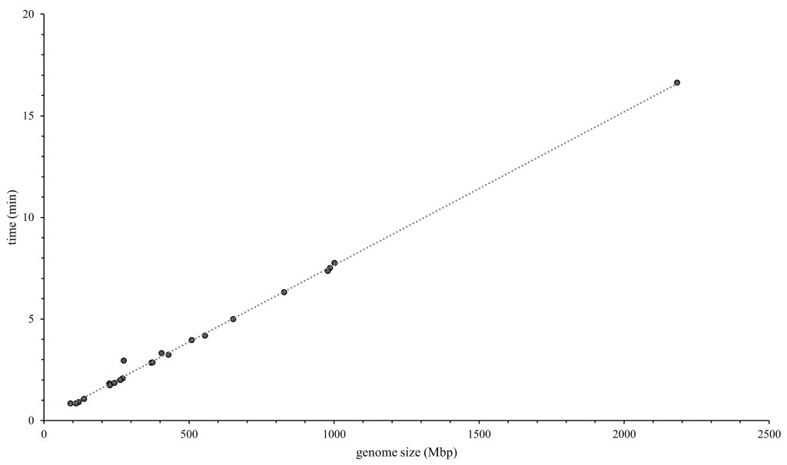
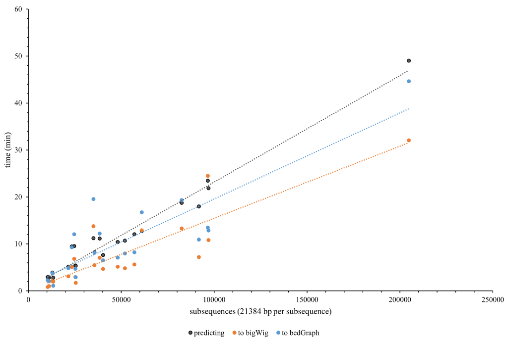

# Performance
Performance of Predmoter depends on hardware, batch size, number of datasets used
(ATAC-seq, ChIP-seq, etc.), model configurations, number of devices/workers and the
device itself. In general training, testing and predicting is way faster on one or
multiple GPUs than on CPUs and faster with more workers in ram efficient mode and
with zero workers when ``--ram-effiecient false``. A general rule of thumb is to
use ``4 workers * number of devices`` when ``--ram-effiecient true``.
    
## The ram-efficient argument
There are two dataset classes, that can be used by Predmoter:    
1. PredmoterSequence:
   - argument: ``--ram-efficient false``
   - compresses all data and stores it in RAM
   - takes time, depending on the dataset size a significant amount of time
     (the longest tested around 2 h), before training to process all the data
   - the data processing time and memory consumption is multiplied by the 
     number of devices used to train on
   - training is a lot faster afterwards, since the data was already processed
     
     
2. PredmoterSequence2:
    - argument: ``--ram-efficient true`` (default, since it's good for testing and predicting) 
    - reads data directly from the hard-drive/file for each chunk
    - takes less time (the longest tested around 15 min) before the training to process the data
    - slows down training as the data is always reprocessed at each get_item call
    - very effective for testing and predicting as the data will need to be processed only once
    - extremely RAM efficient
    - **Warning:** Don't move the input data while Predmoter is running.
 
>**Warning**: The training, testing and prediction recommendation 'percentages'
> are outdated and will be adjusted later.
    
## Training recommendations
All percentages in this table were calculated using a specific setup (hardware,
number of devices (here 2 NVIDIA GeForce 2080Ti for multiple devices tests), etc.)
and may not apply exactly to other setups, but the general trend will still apply.    
The data loading time doesn't factor into the percentages given.
    
| Number of workers | Number of devices | Ram efficient                               | Explanation                                                                                                                                                                                                                                                         |
|:------------------|:------------------|:--------------------------------------------|:--------------------------------------------------------------------------------------------------------------------------------------------------------------------------------------------------------------------------------------------------------------------|
| 0                 | 1                 | False                                       | The RAM efficient method is around 5 times slower than the RAM consuming method when using no workers and just one GPU.                                                                                                                                             |
| mult.             | 1                 | True (large dataset); False (small dataset) | Using the recommended 4 workers, the RAM efficient method is still 16 % slower (5 % with 8 workers), but more resource efficient for large datasets.                                                                                                                |
| 0                 | mult. (here 2)    | False                                       | The RAM efficient method is around 5 times slower than the RAM consuming method when no workers are used. **Warning:** The memory consumption and data loading time are multiplied by the number of devices, so this configuration isn't useful for large datasets. |
| mult.             | mult. (here 2)    | True (large dataset); False (small dataset) | Using the recommended 8 workers, the RAM efficient method is still 7 % slower (22 % with 4 workers), but more resource efficient for large datasets.                                                                                                                |
    
## Testing recommendations
The data loading time (PredmoterSequence/RAM consuming method preloads data, which
takes time) factors into the percentages given, as the data needs to be processed
just once during testing, no matter which dataset class is used. So the data loading
time significantly contributes to the overall performance in contrast to training,
where the data is sent through the model multiple times instead of just once.    
>**Warning**: It is recommended to use
> ``Trainer(devices=1, num_nodes=1)``/``--num-devices 1`` to ensure each
> sample/batch gets evaluated exactly once. Otherwise, multi-device settings
> use `DistributedSampler` that replicates some samples to make sure all devices
> have same batch size in case of uneven inputs.
     
| Number of workers | Number of devices | Ram efficient | Explanation                                                                                                              |
|:------------------|:------------------|:--------------|:-------------------------------------------------------------------------------------------------------------------------|
| 0                 | 1                 | False         | The RAM efficient method is around 40 % slower than the RAM consuming method when using no workers and just one GPU.     |
| mult.             | 1                 | True          | Using the recommended 4 workers, the RAM efficient method is over 3 times faster (with 8 workers almost 7 times faster). |
    
## Predicting recommendations
The data loading time factors into the percentages given (same reasoning as for
testing). When using multiple workers the RAM usage increases a little.
When predicting on the GPU the RAM usage (using ``--ram-efficient true``) was found
to be around 16 GB, predicting on genomes in a range of ~120 Mbp to ~2.2 Gbp. When
predicting on the CPU instead (also using ``--ram-efficient true``) the RAM usage was
found to be around 4 GB, also predicting on genomes in a range of ~120 Mbp to ~2.2 Gbp.
This is a result of PyTorch's and Lightning's method to push the model to the GPU.
Predicting on the CPU takes around 3 times longer than on the GPU.
     
>**Warning**: It isn't possible to predict on multiple devices, since the
> DistributedDataParallel (DDP) strategy copies the script/program
> to each device, resulting in Predmoter trying to write the predictions h5
> file multiple times, resulting in IO errors. It is also not recommended to
> use multiple devices for prediction, as the multi-device settings
> use `DistributedSampler` that replicates some samples to make sure all devices
> have same batch size in case of uneven inputs, which could result in faulty
> predictions.
     
| Number of workers | Number of devices | Ram efficient | Explanation                                                                                                         |
|:------------------|:------------------|:--------------|:--------------------------------------------------------------------------------------------------------------------|
| 0                 | 1                 | False; True   | The RAM efficient method is around 5 % slower than the RAM consuming method when using no workers and just one GPU. |
| mult.             | 1                 | True          | Using the recommended 4 workers, the RAM efficient method is around 3 % faster (6 % with 8 workers).                |
    
## Benchmarking (prediction time)
Benchmarking was performed on a machine with an Intel(R) Xeon(R) CPU W-2125
@ 4.00 GHz and an Nvidia GeForce GTX 1050 Ti GPU (4 Gb memory). The software
versions were CUDA 11.5, cuDNN 8.9.5 and Python 3.10.12. The relevant Python
package versions were PyTorch 2.0.1, Lightning 2.0.8, Helixer version 0.3.2 and
Predmoter version 0.3.2. The exact versions of the other packages used can be found
[here](../benchmarking_package_versions_freeze.txt).    
Depending on the model used, there is always a slight fluctuation in the prediction
and conversion to bigWig or bedGraph files. Two different models BiHybrid_04 and
the combined model were used (see
[here](https://github.com/weberlab-hhu/predmoter_models) to download these models).
The BiHybrid_04 model can predict ATAC-seq cooverage and the combined model ATAC-
and ChIP-seq coverage. Some genome assemblies were highly fragmented, on contig or
scaffold level, increasing the number of subsequences. Since inference and conversion
to bigWig or bedGraph files is dependent on the amount of data, so the number of
subsequences, that was used to quantify the wall time.
     
### Conversion from fasta to h5 files (Helixer)

### Predicting one dataset

### Predicting two datasets simultaneously

